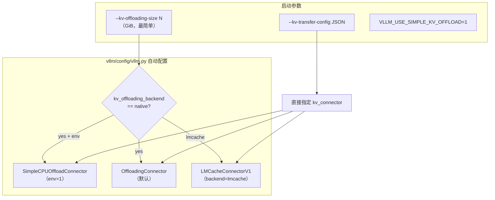
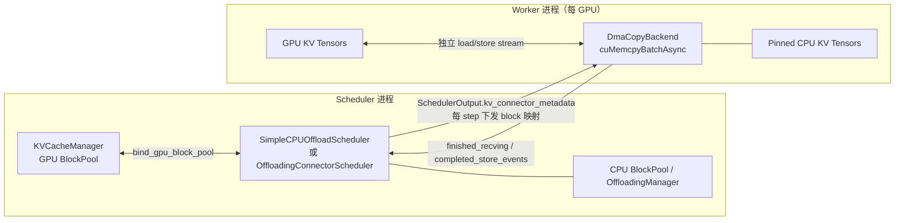
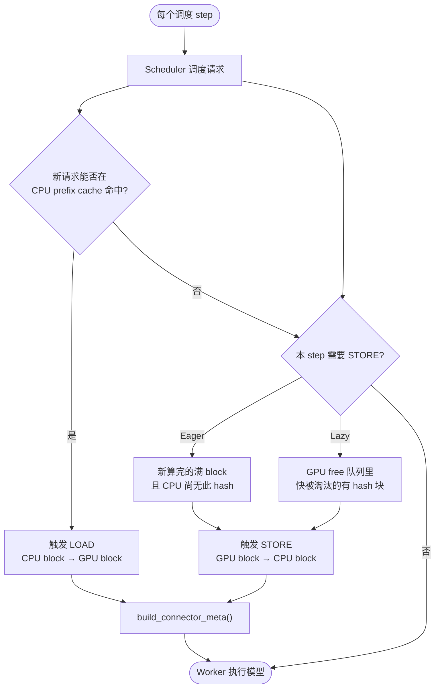
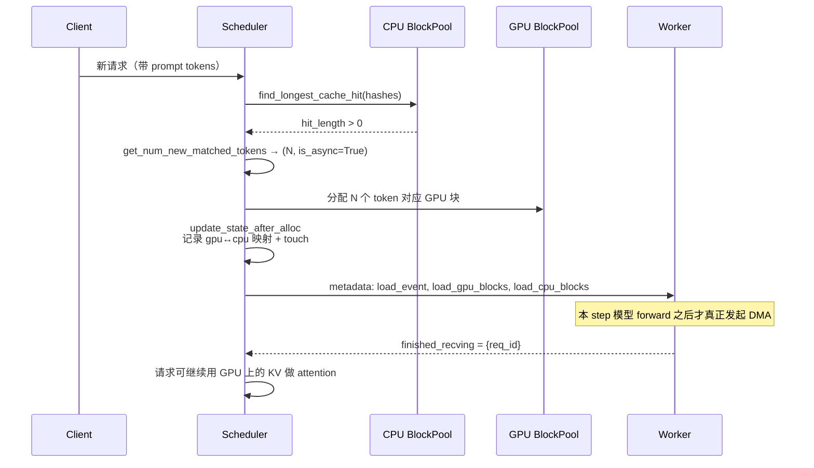
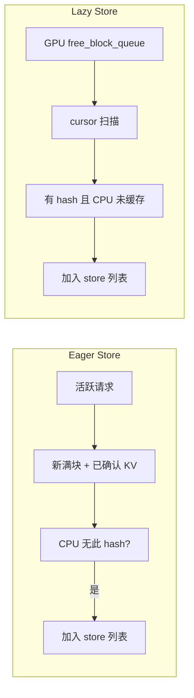
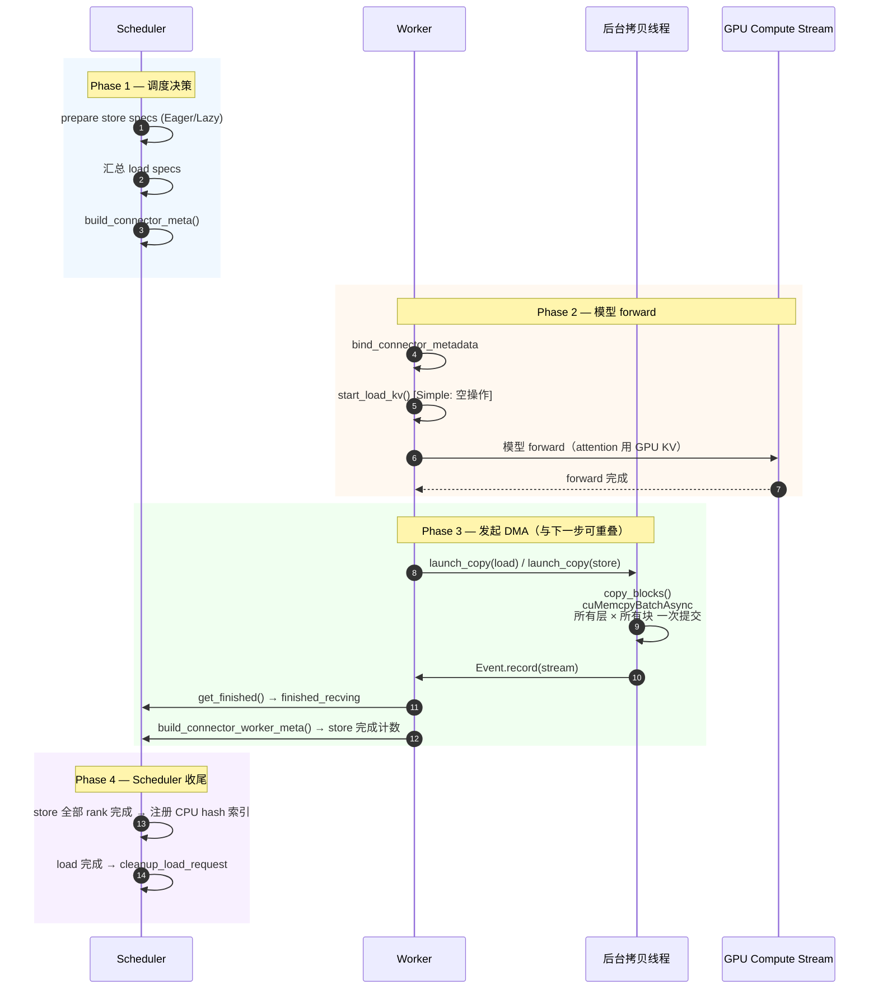
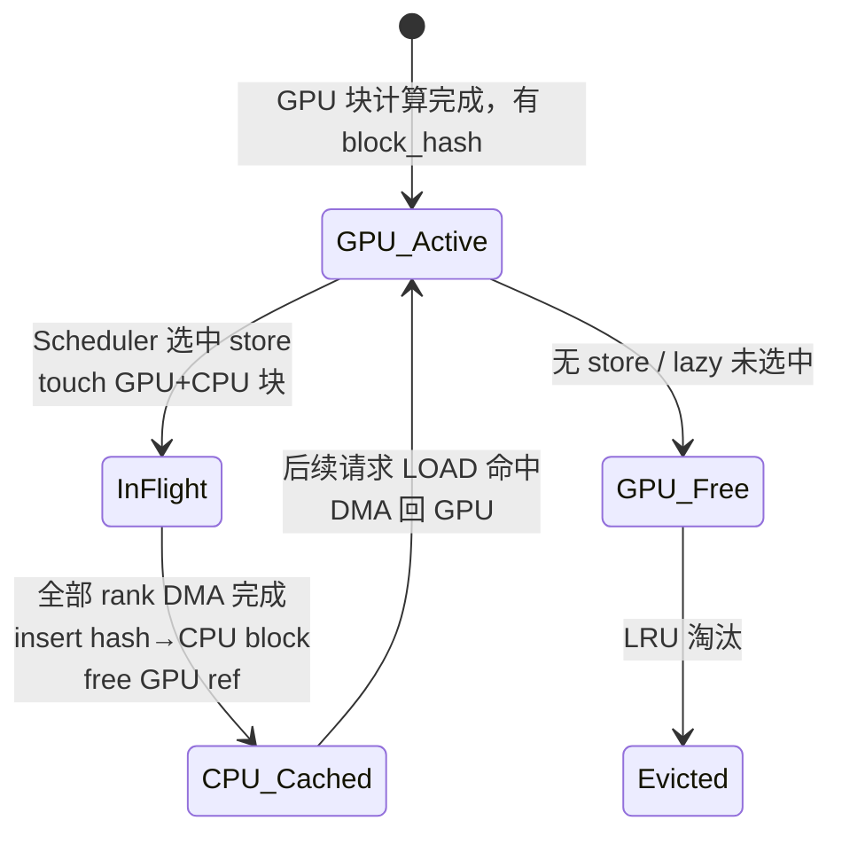

# vLLM KV Cache Offload 使用与实现指南

> 适用版本：`v0.21.0rc3` 及相近分支  
> 本文档说明 **如何开启**、**何时触发**、**如何执行** KV cache offload。  
> 实验与压测见：[KV Cache Offload 实验指南](kv_cache_offload_experiments.md)。

---

## 1. 三类实现，怎么选？

vLLM 在 `v0.21` 提供几类 **KV offload / transfer** 路径，都通过 **KV Connector** 接入调度器：

| 路径 | Connector 名 | 特点 | 推荐场景 |
|------|--------------|------|----------|
| **Simple（新）** | `SimpleCPUOffloadConnector` | 复用 GPU `BlockPool` 做 CPU prefix cache；`cuMemcpyBatchAsync` 批量拷贝；实现集中 | 单机 CPU offload，追求吞吐 |
| **通用框架** | `OffloadingConnector` | `OffloadingManager` 抽象；LRU/ARC 可插拔；可扩展 Mooncake 等 | 需要 ARC、store 过滤、多级介质 |
| **LMCache** | `LMCacheConnectorV1` | token chunk hash；CPU/disk/remote 分层；async loading；layerwise transfer；retrieve threshold | 最快接入工程化 KV reuse/offload；需要异步 reload、逐层流水或多实例共享 |



> **注意**：`--cpu-offload-gb` 是 **模型权重** offload，与 KV cache offload **无关**。

---

## 2. 如何开启（使用方式）

### 2.1 方式 A：顶层参数（推荐）

```bash
# 开启 prefix caching（Simple 路径强制需要；默认已开启）
# 分配 32 GiB CPU KV offload 缓冲区（TP 总和）
vllm serve <model> \
  --enable-prefix-caching \
  --kv-offloading-size 32 \
  --kv-offloading-backend native
```

- `kv_offloading_size`：CPU 缓冲区大小（**GiB**）。`None` = 不启用 offload。
- `kv_offloading_backend`：
  - `native` → 自动选 `OffloadingConnector` 或 `SimpleCPUOffloadConnector`
  - `lmcache` → `LMCacheConnectorV1`

选用 Simple 路径：

```bash
export VLLM_USE_SIMPLE_KV_OFFLOAD=1
vllm serve <model> --kv-offloading-size 32 --kv-offloading-backend native
```

### 2.2 方式 B：显式 KV Transfer Config（Simple / Native）

```bash
vllm serve <model> \
  --enable-prefix-caching \
  --kv-transfer-config '{
    "kv_connector": "SimpleCPUOffloadConnector",
    "kv_role": "kv_both",
    "kv_connector_extra_config": {
      "cpu_bytes_to_use": 34359738368,
      "lazy_offload": false
    }
  }'
```

**SimpleCPUOffloadConnector 常用 extra 参数：**

| 参数 | 默认 | 含义 |
|------|------|------|
| `cpu_bytes_to_use` | 8 GiB | 全集群 CPU 容量；会除以 `world_size` 得到每 rank |
| `cpu_bytes_to_use_per_rank` | 自动推导 | 显式覆盖每 rank 容量 |
| `lazy_offload` | `false` | `false`=Eager 按请求存；`true`=Lazy 按 GPU 淘汰队列存 |

**OffloadingConnector 常用 extra 参数：**

| 参数 | 默认 | 含义 |
|------|------|------|
| `cpu_bytes_to_use` | 必填 | CPU 块池总字节 |
| `spec_name` | `CPUOffloadingSpec` | Offload 后端 spec |
| `eviction_policy` | `lru` | `lru` 或 `arc` |
| `store_threshold` | `0` | ≥2 时：块被 lookup 够 N 次才允许 store（减少无效下盘） |
| `block_size` | GPU block | offload 块 = N × GPU block |

### 2.3 方式 C：LMCacheConnectorV1

LMCache 是当前最快落地的工程方案：vLLM 负责调度与执行，LMCache 负责 chunk hash、分层存储、async lookup/retrieve、layerwise store/retrieve 等。

最小 CPU offload 配置：

```yaml
# lmcache_config.yaml
chunk_size: 256
local_cpu: true
max_local_cpu_size: 100
```

```bash
LMCACHE_CONFIG_FILE=lmcache_config.yaml \
vllm serve <model> \
  --enable-prefix-caching \
  --kv-transfer-config '{"kv_connector":"LMCacheConnectorV1","kv_role":"kv_both"}'
```

带 reload 加速的实验配置：

```yaml
# lmcache_config.yaml
chunk_size: 256
local_cpu: true
max_local_cpu_size: 100
enable_async_loading: true
min_retrieve_tokens: 1024
use_layerwise: true
```

也可用顶层参数接入本机 CPU LMCache：

```bash
vllm serve <model> \
  --enable-prefix-caching \
  --kv-offloading-size 32 \
  --kv-offloading-backend lmcache
```

但顶层参数只自动设置 `lmcache.local_cpu=true` 与 `lmcache.max_local_cpu_size=<per-rank GiB>`；`enable_async_loading`、`min_retrieve_tokens`、`use_layerwise` 等仍建议放在 `LMCACHE_CONFIG_FILE` 中。

关键 knobs：

| 参数 | 作用 | 经验起点 |
|------|------|----------|
| `chunk_size` | LMCache chunk 粒度；影响 lookup 数量与搬运批大小 | `256` |
| `enable_async_loading` | scheduler 先做 chunk hash lookup，worker 侧异步 retrieve；命中后预取，减少同步阻塞 | `true` |
| `min_retrieve_tokens` | 命中 token 数低于阈值时跳过 retrieve，直接 recompute | `1024` 起扫 |
| `use_layerwise` | 按 layer retrieve/store，把「整段 KV 全部 load 完」改成逐层流水 | `true` |

> 注意：`use_layerwise=true` 会引入 layerwise 异步同步点，vLLM 需要 PIECEWISE CUDA graph 或 eager。若通过 `kv_connector_extra_config` 而不是 `LMCACHE_CONFIG_FILE` 设置 layerwise，当前代码里还应带上未加前缀的 `"use_layerwise": true`，以触发 `LMCacheConnectorV1.requires_piecewise_for_cudagraph()`。

### 2.4 前置条件检查清单

- [ ] `enable_prefix_caching=True`（Simple 路径未开启会 **自动禁用** offload）
- [ ] `kv_offloading_size` 或 `kv_transfer_config` 已配置
- [ ] Simple 路径：CUDA driver 支持 `cuMemcpyBatchAsync`（较新驱动）；ROCm 需 7.1+
- [ ] TP/PP > 1 时：store 完成需 **所有 rank** 上报后才对 scheduler 可见
- [ ] LMCache 路径：`LMCACHE_CONFIG_FILE` 可读；`enable_async_loading` / `use_layerwise` 与 benchmark 目标一致

---

## 3. 整体架构



**角色分工：**

| 组件 | 职责 |
|------|------|
| **Scheduler** | 决定本 step 哪些 block **load**（CPU→GPU）或 **store**（GPU→CPU）；维护 CPU 侧 hash→block 索引；`touch` 防止拷贝中被驱逐 |
| **Worker** | 在 **低优先级 CUDA stream** 上异步 DMA；用 `torch.Event` 回报完成 |
| **Prefix hash** | 每个满 block 有 `block_hash`；CPU/GPU 两侧用同一 hash 做 cache 命中 |

---

## 3.1 Simple 路径的 6 个关键机制

> Simple 路径是这个版本里推荐的实现；通用 `OffloadingConnector` 的差异见 §5.3。

### ① 对称 BlockPool

`SimpleCPUOffloadScheduler._derive_cpu_config()`：从 GPU 的 `KVCacheConfig` 派生一份 **CPU 版**——同一套 `KVCacheCoordinator + BlockPool`，只把 `num_blocks` 按 CPU 容量等比例缩放。

- CPU 端直接复用 prefix cache 的 `cached_block_hash_to_block` 索引
- 这就是为什么 offload **必须开 prefix caching**

### ② Pinned CPU 内存（绕开 PyTorch allocator）

```python
tensor = torch.zeros(cpu_shape, dtype=..., device="cpu")
pin_tensor(tensor)   # cudaHostRegister(data_ptr, nbytes, 0)
```

不用 `pin_memory=True`：PyTorch 的 `CUDACachingHostAllocator` 会把每次分配 **向上对齐到 2 的幂**（100 GB → 128 GB 直接 OOM）。手动 `cudaHostRegister` 按实际字节 pin。

### ③ Layout 归一化（兼容多 attention backend）

- FlashAttn / ROCm 的 `(2, num_blocks, ...)` → 拆成两段 int8 视图
- FlashInfer / MLA 的 `(num_blocks, ...)` → 一段视图
- 统一保证 `stride(0) * element_size = bytes_per_block`，DMA 用同一段代码

### ④ 批量拷贝引擎：`cuMemcpyBatchAsync`

`vllm/v1/simple_kv_offload/cuda_mem_ops.py`：

- `cuGetProcAddress("cuMemcpyBatchAsync", 12080, 0)` 拿 driver API；ROCm 走 `hipMemcpyBatchAsync`
- `build_params()` 预计算每个 unique tensor 的 `(data_ptr, bytes_per_block)`
- `copy_blocks(src_ids, dst_ids)`：numpy 广播一次生成 `num_layers × num_blocks` 个 `(dst, src, size)`，**一次 driver 调用** 提交整批
- `srcAccessOrder = CU_MEMCPY_SRC_ACCESS_ORDER_ANY`：允许 driver 乱序，提升吞吐

### ⑤ 后台线程 + 双低优先级 stream

`DmaCopyBackend._copy_loop`：

- 一个 daemon 线程 + `queue.SimpleQueue` 接任务
- 两个独立 stream：`load_stream` / `store_stream`，**priority = lowest**，不抢 attention 算力
- 任务执行：`copy_blocks()` → `torch.Event.record(stream)` 入队

**为什么放后台线程**：Python 端组 batch + driver 调用约 ~5ms，背景跑可以和模型 forward 重叠。

### ⑥ DMA 推迟到 forward 之后

Simple 的 `start_load_kv()` 是 **空操作**；真正的 `launch_copy(load)` 与 `launch_copy(store)` 在 `get_finished()` 里执行（forward 完后）。

这样 Python 侧 ~5ms 开销 **隐藏在下一步 GPU forward 之后**，不占当前 step 关键路径。代价：load 的 KV 不在本 step 立刻可用，需要 `is_async=True` 让 scheduler 知道「下一步才能用」。

---

## 4. 何时触发 KV Offload？

### 4.1 总览：两类操作



### 4.2 LOAD（CPU → GPU）触发条件

**时机**：新请求入队 / 分配 KV 块时（`get_num_new_matched_tokens` + `update_state_after_alloc`）。

**条件**（需同时满足）：

1. `enable_prefix_caching` 已开启
2. 请求的 `block_hashes[]` 在 **CPU BlockPool** 上能连续命中一段后缀
3. Scheduler 为命中段分配了 GPU 块，并记录 `TransferMeta(gpu_ids, cpu_ids)`
4. 对涉及的 CPU/GPU 块执行 `touch()`，防止异步 load 完成前被释放



### 4.3 STORE（GPU → CPU）触发条件

#### Eager 模式（`lazy_offload=false`，默认）

**时机**：每个调度 step 的 `build_connector_meta()` → `_prepare_eager_store_specs()`。

**对每条活跃请求**，扫描「已 store 游标」到「已确认计算完成」之间的 GPU 块：

| 条件 | 说明 |
|------|------|
| `gpu_block.block_hash != None` | 满块且已 hash |
| CPU 尚无该 hash | 避免重复 store |
| `confirmed_tokens` 覆盖该块 | `confirmed_tokens = num_computed_tokens − num_output_placeholders`；防止把「刚 launch 还没真写完」的 KV 当作可 store——**当前 step 刚算完的块要等下一步才能 store** |
| CPU 有空闲块 | `num_free > 0` |

> 实现位置：`SimpleCPUOffloadScheduler._prepare_eager_store_specs()`，按 `state.num_stored_blocks` 游标推进，避免重复扫。

#### Lazy 模式（`lazy_offload=true`）

**时机**：每 step `_prepare_lazy_store_specs()`。

**策略**：沿 GPU `free_block_queue` 用 cursor 扫描，只 offload **即将进入 LRU 淘汰**、且 **CPU 尚未缓存** 的有 hash 块。

**Watermark**：`_estimate_lazy_target_blocks()` 估算「每 step 想保留多少个 free/已 offloaded 块」，FullAttention 组按 `cdiv(max_num_batched_tokens, block_size)`，乘以 `1 + WATERMARK_RATIO`（默认 `1.0`，即 ≈ `2 × max_num_batched_tokens / block_size`）。SlidingWindow / Mamba 另有公式。



### 4.4 抢占时的强制同步

若本 step 有 **preempted** 请求，Worker 在 forward 前调用 `handle_preemptions()` → **同步所有在飞 load/store**，避免 GPU 块被复用后 DMA 仍访问旧数据。

---

## 5. Offload 如何执行？（逐步数据流）

### 5.1 单个调度 Step 时间线（Simple 路径）



**设计要点（Simple 路径）：**

- **DMA 推迟到 forward 之后**：`start_load_kv()` 为空；在 `get_finished()` 里才 `launch_copy`，让 Python 侧组 batch 的开销（~5ms）藏在 GPU compute 后面。代价：load 的 KV **本 step 不可用**，scheduler 用 `is_async=True` 标记，下一步才用。
- **双 stream**：`load_stream` / `store_stream` 均为最低优先级，尽量不抢 attention 算力。
- **批量拷贝**：`cuda_mem_ops.copy_blocks()` 用 numpy 广播生成 `num_layers × num_blocks` 个 `(src,dst,size)`，一次 `cuMemcpyBatchAsync` 提交。
- **Pinned CPU 内存**：`torch.zeros` + `cudaHostRegister`，避免 PyTorch pin_memory 按 2 的幂对齐导致 OOM。
- **TP/PP 完成聚合**：每个 worker 独立 `Event.record`；scheduler 端累计 `_store_event_pending_counts[event_idx]`，达到 `world_size` 后才把 CPU 块 `insert` 进 hash 表，避免 rank 间状态不一致。
- **防异步 race**：scheduler 对涉及块全部 `touch()` 增加 `ref_cnt`，DMA + 全 rank 上报完成后才 `free`，整个生命周期里 GPU/CPU 块都不会被别人复用。

### 5.2 Store 完成后的状态变化



### 5.3 OffloadingConnector 路径的差异

| 环节 | Simple | OffloadingConnector |
|------|--------|---------------------|
| Scheduler 决策 | `SimpleCPUOffloadScheduler` + BlockPool | `OffloadingConnectorScheduler` + `CPUOffloadingManager` |
| 块标识 | `block_hash`（BlockPool 原生） | `OffloadKey = hash + group_idx` |
| Worker 拷贝 | `DmaCopyBackend` + batch API | `CpuGpuOffloadingHandlers`（`v1/kv_offload/cpu/gpu_worker.py`） |
| load 启动 | forward **后** | `start_load_kv()` 在 forward **前** |
| store 启动 | forward **后** | `wait_for_save()` 在 forward **后** |
| 淘汰 | BlockPool LRU | LRU / ARC + 可选 `store_threshold` 过滤 |

### 5.4 LMCache 路径的性能差异

LMCache 的核心目标不是只把 KV 放到 CPU，而是把 **lookup / retrieve / store** 变成可流水的工程链路：

| 机制 | 作用 | 对 reload latency 的影响 |
|------|------|--------------------------|
| token chunk hash lookup | 按 chunk 查命中，不要求整段 prompt 全命中 | 允许部分命中与批量 contains/get |
| `enable_async_loading` | scheduler 发起 lookup，worker 侧 async lookup server 与 non-blocking retrieve 并行 | reload 不再完全阻塞调度线程；miss 快速返回 |
| `use_layerwise` | `retrieve_layer()` / `store_layer()` 逐层推进 | layer 0 KV ready 后可先算 layer 0，同时 load 后续 layer |
| `min_retrieve_tokens` | 小命中跳过 retrieve | 避免固定开销、Python 开销、PCIe 小包开销超过 recompute 收益 |
| CPU/disk/remote tier | 本地 CPU、磁盘、远端 KV backend 分层 | 单机先测 CPU；多实例再测 remote / P2P |

粗略决策公式：

```text
T_load = T_fixed + KV_bytes / BW_eff + T_deserialize
T_recompute = N_tokens * T_prefill_per_token

只有 T_load < T_recompute 时才 retrieve，否则 recompute。
```

这就是 `min_retrieve_tokens` / recompute threshold 的意义：KV offload 慢的常见原因不是大块搬运，而是大量小命中被同步 reload。

Layerwise 的收益来自 latency hiding：

```text
传统：load all layers' KV -> forward
逐层：load layer 0 -> compute layer 0
     while compute layer 0, load layer 1
     while compute layer 1, load layer 2
```

若实验目标是「CPU↔GPU reload 更快」，优先级应是：先开 LMCache + async loading，再测 layerwise，再扫 `min_retrieve_tokens`；只有多实例/多机共享时再优先看 NIXL / RDMA / P2P。

---

## 6. 内存布局（Worker 侧）

> 与 §3.1 ③ 配合阅读：这一节给出布局细节，§3.1 ③ 给出设计动机。

GPU KV tensor 物理布局因 backend 而异，Worker 会 **归一化** 为 `(num_blocks, bytes_per_block)` 的 int8 视图再 DMA：

```
FlashAttention:  (2, num_blocks, ...)  → 拆成 .0 / .1 两段，各 (num_blocks, page_bytes)
FlashInfer/MLA:  (num_blocks, ...)      → 直接 (num_blocks, page_bytes)

CPU 侧：torch.zeros(num_cpu_blocks, ...) + cudaHostRegister
```

拷贝粒度始终是 **一个 logical block 的全部层 K/V 数据**（对该 block_id 在所有 unique tensor 上各拷一次）。

---

## 7. 快速排错

| 现象 | 可能原因 |
|------|----------|
| offload 未生效 | 未设 `kv_offloading_size`；或 prefix caching 关闭（Simple 会 warn 并禁用） |
| `cuMemcpyBatchAsync` 报错 | CUDA driver 过旧；需升级驱动 |
| CPU 内存远大于配置 | 误用 `pin_memory=True`；Simple 已用 `cudaHostRegister` 规避 |
| 命中了 CPU cache 但仍重算 | load 未完成就调度了依赖块；查 `finished_recving` 路径 |
| TP 下 store 迟迟不可见 | 需等 `world_size` 个 worker 都上报 `completed_store_events` |
| `reset_prefix_cache` 失败 | Simple 路径尚未实现与 pending store 的同步 |

---

## 8. 代码索引

| 主题 | 路径 |
|------|------|
| Simple Connector 入口 | `vllm/distributed/kv_transfer/kv_connector/v1/simple_cpu_offload_connector.py` |
| Scheduler 逻辑 | `vllm/v1/simple_kv_offload/manager.py` |
| Worker + DMA | `vllm/v1/simple_kv_offload/worker.py`, `copy_backend.py`, `cuda_mem_ops.py` |
| 通用 Connector | `vllm/distributed/kv_transfer/kv_connector/v1/offloading_connector.py` |
| CPU Manager (LRU/ARC) | `vllm/v1/kv_offload/cpu/manager.py` |
| 抽象接口 | `vllm/v1/kv_offload/base.py` |
| 自动配置 | `vllm/config/vllm.py` → `_post_init_kv_transfer_config()` |
| Worker 生命周期 | `vllm/v1/worker/kv_connector_model_runner_mixin.py` |
| Cache 参数 | `vllm/config/cache.py` → `kv_offloading_size` |

---

## 9. 最小可运行示例

```bash
# Simple 路径：32GB CPU KV cache，Eager store
export VLLM_USE_SIMPLE_KV_OFFLOAD=1

vllm serve meta-llama/Llama-3.2-1B-Instruct \
  --max-model-len 8192 \
  --enable-prefix-caching \
  --kv-offloading-size 32 \
  --kv-offloading-backend native \
  --kv-transfer-config '{"kv_connector_extra_config":{"lazy_offload":false}}'
```

发送两条 **相同 system prompt** 的请求时，第二条应触发 **LOAD**（日志可见 CPU cache hit / async load），GPU 显存占用更稳定；长上下文 + 高并发时 **STORE** 会把冷块换到 CPU。

---

## 10. 后续讨论重点：连续 KV 布局、强制 Offload 与 DMA 局部性

> **状态**：设计探讨 / 未落地。本节汇总「为提升 offload DMA 效率而调整 KV 物理布局」的讨论，供后续 PR 或实验对齐。

### 10.1 问题背景

当前 **Simple** 路径的 DMA 是 **按层 × 按 block** 组 batch（`cuMemcpyBatchAsync` 一次提交 `num_layers × num_blocks` 段）。段数多、单段大小有限时，PCIe 可能打不满（见 §10.5）。

一种常见设想：**把 KV 做成更连续的布局 + 强制开启 offload**，以改善 DMA 局部性与带宽利用率。

需要先分清「连续」指什么——不同含义对 vLLM 架构的冲击完全不同。

### 10.2 「连续 KV」的三种含义

| 类型 | 含义 | DMA 局部性 | 对 vLLM 冲击 | Prefix cache |
|------|------|------------|--------------|--------------|
| **A. Cross-layer per block** | 同一 `block_id` 下，**所有层的 KV 在物理地址上连续**（uniform / `cross_layers_kv_cache`） | 较好：每 block **1 段** DMA 覆盖全部层 | **中等**（已有条件开启路径） | **仍可用**（逻辑仍是 block + `block_hash`） |
| **B. Per-request 整段连续** | 每条请求 prompt 在 GPU/CPU 上 **一整段连续 buffer**（静态 cache） | 最好：大块 `memcpy` | **极大**（≈ 重做 PagedAttention） | **与现有 block 共享机制冲突** |
| **C. 全局连续池** | 单一大 tensor，按偏移切分 | 中等 | 大 | 需重写分配与共享 |

**结论（讨论共识）**：若目标是 **更好 DMA** 且 **保留 vLLM 调度语义**，应优先讨论 **类型 A**，而非类型 B/C。

### 10.3 Prefix cache 是否必须放弃？

**不必。** Prefix caching 的粒度是 **block + 链式 `block_hash`**，与物理上 per-layer 碎 tensor 还是 cross-layer 大 tensor **正交**：

- 调度仍用 `BlockPool`、`block_id`、`cached_block_hash_to_block`
- 命中仍按 hash 链查最长前缀

vLLM 已在 **配置 KV Connector 且 backend 支持** 时提供 uniform 布局（`KVConnectorModelRunnerMixin.use_uniform_kv_cache()`），条件包括：

1. 单一 KV cache group、各层 page size 一致
2. Connector `prefer_cross_layer_blocks() == True`（如 `OffloadingConnector`、Nixl、部分 Mooncake 路径）
3. Attention backend 的 `get_kv_cache_stride_order(include_num_layers_dimension=True)` 支持将 `num_layers` 作为可连续维度

**SimpleCPUOffloadConnector 现状**：仍走 per-layer `dict` + `register_kv_caches()`，**未**实现 `prefer_cross_layer_blocks` / `register_cross_layers_kv_cache()`，因此尚未吃到类型 A 的单 block 单次 DMA 红利。这是 **实现缺口**，不是 prefix cache 与连续布局不可兼得。

### 10.4 架构冲击分档（改动量评估）

#### 低档（推荐作为后续实验方向）

- 在满足 §10.3 条件时启用 **uniform / cross-layer KV**
- 扩展 **SimpleCPUOffloadConnector**：支持 `register_cross_layers_kv_cache`，每 block **一次** H2D/D2H（`O(blocks)` 次拷贝而非 `O(layers × blocks)`）
- **保留**：PagedAttention、`block_table`、prefix cache、chunked prefill、抢占

**预期收益**：降低 DMA 启动次数与 Python 组 batch 开销，更易吃满 PCIe。  
**预期冲击**：Connector + Worker 注册与 `copy_blocks` 路径扩展，**不**改 Scheduler 块语义。

#### 中档：强制所有模型连续 + 强制 offload

| 风险点 | 说明 |
|--------|------|
| Hybrid（Mamba + Attention） | 多 group、不同 page size，难以统一 cross-layer |
| MLA / 非常规 layout | 未必支持 `num_layers` 维 stride |
| 无 connector 的部署 | 今日 `use_uniform_kv_cache` 直接为 false |
| 强制 offload | 无 KV 压力的工作负载仍付 CPU 池 + DMA；Simple 还依赖 prefix caching |
| HMA / sliding window | block 语义更复杂 |

**冲击：大**；大量配置无法启用或需 fork 多个 attention backend。

#### 高档：Per-request 整段连续（类型 B）

等于放弃按 block 分页、跨请求共享物理块、prefix 按 block 去重等核心设计。需重写 `KVCacheManager`、`allocate_slots`、preemption、多数 attention 接口等。

**冲击：极大**；不宜作为「仅优化 offload DMA」的附带改动。

### 10.5 DMA 带宽与「局部性」

二者相关但不等价：

| 概念 | 含义 |
|------|------|
| **局部性差** | 热数据在 CPU，算前必须 DMA；两级存储 |
| **带宽未打满** | 单次搬运字节少、Python 组 batch 开销、PCIe 争用、单队列未流水线 |

**Simple 已做的带宽优化**：`cuMemcpyBatchAsync`、`cudaHostRegister`、`srcAccessOrder=ANY`（CUDA）、独立 load/store 低优先级 stream。

**仍可能打不满的情况**：

- 每 step 仅少量 block（传输太短）
- 仍是多段 scatter（层 × 块），非单段巨型 `memcpy`
- 后台单线程队列，应用层无双缓冲预取
- Load 在 forward **之后** 才提交，同请求很难「边算边搬下一批」
- 与 compute / NCCL 争用 PCIe

**类型 A（cross-layer）对带宽的改善**：在相同 block 数下，把 batch 条目数从 `layers × blocks` 降为 **`blocks`**，更接近「大块 DMA」。

### 10.6 强制 Offload 的隐性成本

即使布局优化，**强制** `--kv-offloading-size` / 始终 store 仍意味着：

- 额外 PCIe 往返与 CPU 内存（`cpu_bytes_to_use`）
- CPU 命中时 load 至少晚一步（Simple：`start_load_kv` 为空，DMA 在 `get_finished`）
- TP 下 store 需 **全 rank** 完成才进入 CPU hash 表
- 工作集全在 GPU 的 job **变慢**

Offload 解决的是 **「模型能装上 GPU，但 KV block 池不够」**，不能替代 **权重放不进 GPU** 的场景（应看量化 / TP / `cpu_offload_gb` 等）。

### 10.7 建议的后续路线（待验证）

```text
1. 保持 block 粒度 + prefix cache（不改调度语义）
2. 在「单 group + backend 支持」模型上启用 uniform KV
3. 为 SimpleCPUOffloadConnector 增加 cross_layers 注册与每-block 单次 memcpy
4. Benchmark：PCIe 带宽、prefix 命中率、TTFT/ITL vs 当前 per-layer batch（见 [实验指南](kv_cache_offload_experiments.md)）
```

**不建议默认**：全局强制连续 KV + 全局强制 offload。

### 10.8 实验成功标准（讨论用）

- [ ] 相同总字节下，PCIe 实测带宽 closer to 峰值（对比 `num_blocks=1` vs `32`）
- [ ] Prefix 命中率与 TTFT/ITL 不劣于当前 Simple 路径
- [ ] Hybrid / MLA 等模型不被「强制连续」路径误伤
- [ ] TP 下 store 全 rank 聚合延迟可接受

### 10.9 相关代码入口（便于跟进）

| 主题 | 路径 |
|------|------|
| 是否启用 uniform KV | `vllm/v1/worker/kv_connector_model_runner_mixin.py` → `use_uniform_kv_cache()` |
| Cross-layer 注册 API | `vllm/distributed/kv_transfer/kv_connector/v1/base.py` → `prefer_cross_layer_blocks`, `register_cross_layers_kv_cache` |
| 已支持 cross-layer 的 Connector | `offloading_connector.py`, Nixl, `mooncake/store/` 等 |
| Simple 尚未接 cross-layer | `simple_cpu_offload_connector.py`, `simple_kv_offload/worker.py` |
| 当前 per-layer batch DMA | `simple_kv_offload/cuda_mem_ops.py` → `copy_blocks()` |

### 10.10 待决问题（后续讨论填写）

1. 目标模型范围：仅纯 Transformer，还是包含 MLA / Mamba hybrid？
2. 仅优化本机 CPU offload，还是同时考虑 Mooncake / PD 传 KV？
3. Simple 接 cross-layer 后，是否仍保留 per-layer `copy_blocks` 回退路径？
4. Eager vs Lazy store 下，大块 DMA 对 ITL 的实测曲线？

---

## 相关文档

- **[KV Cache Offload 实验指南](kv_cache_offload_experiments.md)**：7×3090 + Qwen 环境下的带宽利用率、性能影响与压测脚本说明。
