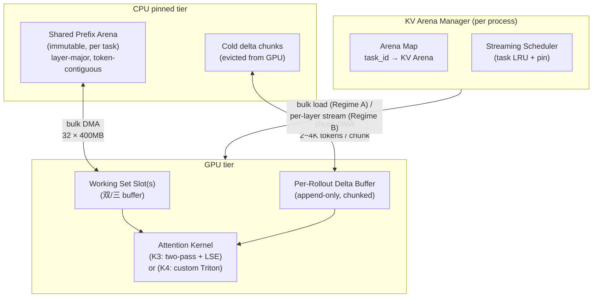

# RFC: Streaming KV Management for Agentic-RL

> **Status**: Draft (Phase 0 design)
> **Author**: <TBD>
> **Date**: 2026-05-19
> **Related**: [KV Cache Offload 使用与实现指南](./kv_cache_offload_guide.md), [KV Cache Offload 实验指南](./kv_cache_offload_experiments.md)

---

## 0. TL;DR

针对 **agentic-RL（尤其是 coding agent）** 这类「长共享 prefix + 多 rollout fan-out + 可预测生命周期」的工作负载，现有 vLLM 的 **PagedAttention + KV offload** 组合存在结构性短板：block 粒度细、KV offload 是 bolt-on 而非一等公民、offload/load 需要搬运大量非连续 block/layer segment、冷启动并发 fan-out 时 prefix 尚未 materialize 到 cache，可能重复 prefill/占块。

本 RFC 提议探索一种 **以 offload 为标配** 的新 KV 管理方式：

- **Layout (L1)**：Task-level **Shared Prefix Arena** + Per-rollout **Append-only Delta Buffer**，物理连续、层级有序
- **流水掩盖**：bulk task-arena swap (Regime A) + per-layer streaming (Regime B) 两套 pipeline，把所有 DMA 隐藏在计算之下
- **内存局部性友好搬运**：把 H2D/D2H 从大量 block/layer segment 转成「连续大段」DMA；PCIe 带宽利用率目标值由 microbenchmark 校准后确定
- **不替代 PA**：作为 vLLM 的可选 streaming-KV mode 存在；PoC 阶段先以独立 mini-runtime 形态验证 claim

**长期目标（完整 RFC 验收）**：

| 维度 | 目标（vs vLLM PA + offload baseline） |
|------|---|
| Decode latency | 不退化（≤ baseline） |
| Prefill throughput | ≥ 2× |
| GPU 内存有效利用（concurrent task 数） | ≥ 2× |
| 任务切换成本 | ≤ 30% × baseline |

**当前实验验收按阶段进行**：

- **Phase 1 / Mainline**：先只验证 `CA2` task swap / offload cycle
- **Phase 2 / Appendix → future Mainline**：再补 GPU 内存有效利用等维度

---

## 1. 背景 & 动机

### 1.1 Agentic-RL 与 Coding Agent 工作负载

Coding agent rollout 的典型形状：

```
                ┌── rollout 0: prefix [系统提示 + 仓库代码 + 任务] + 增量 [tool_call_0, obs_0, ...]
task (1 prompt) ┼── rollout 1: 同一 prefix + 不同增量
                ┼── rollout 2: 同一 prefix + 不同增量
                └── ...                                                     (fan-out: 4 ~ 16)
```

关键结构特征：

| 特征 | 量级 | 对 KV 管理的暗示 |
|------|------|----|
| 仓库上下文超长 | 100K ~ 1M token | prefill 主导；KV 总量大 |
| Prefix 强共享（系统 prompt + 仓库代码 + 任务描述） | 同 task 所有 rollout 完全相同 | 应做 task-level 共享；warm cache 下 PA 已有 block-level 物理共享，但冷并发 fan-out 与 offload 粒度仍有优化空间 |
| 增量短（每 tool call） | 几百 ~ 几千 token | delta 适合 **bump-pointer / append-only** |
| Tool call 顺序确定 | 下一段要算的 KV 是 **已知的** | 调度器可做 **精确预取**，不是猜的 |
| RL fan-out | 4 ~ 16 rollout | 共享 prefix → GPU 上不应有 N 份冗余 |
| 生命周期可预测 | task 边界、终止条件 RL 框架已知 | 不需要 PA 那种「随机生灭」的灵活分配 |
| Trajectory 进入 replay buffer | KV 跨 step、跨 epoch 复用 | 持久化导出接口要预留 |

### 1.2 现状：vLLM PA + KV Offload 的结构性短板

现有 [KV Cache Offload](./kv_cache_offload_guide.md) 已经在 v0.21 提供了两条 connector 路径（Simple / OffloadingConnector），但它们都是在 **PagedAttention 之上** 加 offload 能力，继承了 PA 的核心抽象：

#### 1.2.1 PA 的核心抽象与代价

- 每 16 token 一个小 block，block 散落在 GPU pool 中
- attention kernel 走 block table 做间接寻址
- prefix 共享通过 block 级 `ref_cnt` 实现；cache hit 后多个请求复用同一物理 KV block，但粒度仍是 PA block，物理布局仍是 block-pool 分散布局

这套设计针对 **OLTP 式 serving**（请求随机到达、长度未知、要求碎片最小）做了很好的权衡。但在 agentic-RL 场景下，三个代价被放大：

1. **搬运粒度与局部性受 PA block 限制**：100K prefix = 6250 个 16-token block；SimpleCPUOffloadConnector 使用 batch memcpy 聚合搬运，但源/目标仍是大量 block/layer segment，而非 task arena 连续大段
2. **warm hit 有物理共享，cold fan-out 仍可能重复**：PA prefix cache hit 后确实复用同一物理 block；但 16 rollout 同时冷启动时，首个 prefix 还未进入 cache，scheduler 可能让多个 rollout 各自 prefill/占块
3. **offload 是 bolt-on**：从 [`SimpleCPUOffloadConnector`](../../vllm/distributed/kv_transfer/kv_connector/v1/simple_cpu_offload_connector.py) 的实现可见，CPU 侧是 GPU BlockPool 的对称缩放版，**沿用了 GPU 上的 block-pool 布局**——这对通用 serving 合理，但不是为 task-level bulk swap / per-layer streaming 优化

#### 1.2.2 数字测算（背景论证）

以 Qwen3-4B（36 层、128 head_dim、8 KV head、bf16/fp16 KV）、PCIe 4.0 x16（~32 GB/s 理论，实测有效值由 microbenchmark 校准）为基准：

| 量 | 公式 | 结果 |
|---|---|---|
| 一层 prefix KV（100K token） | 100K × 128 × 8 × 2(K+V) × 2B | **~391 MiB** |
| 完整 prefix（36 层） | 36 × 391 MiB | **~14.1 GiB** |
| 单层 16-token block | 16 × 128 × 8 × 2 × 2B | **64 KiB** |
| 全模型 16-token block | 36 × 64 KiB | **2.25 MiB** |
| PA offload 一份 prefix 的搬运量 | 6250 blocks × 2.25 MiB / block | **~14.1 GiB** |
| L1 bulk DMA 同样 KV 量 | 14.1 GiB ÷ 实测连续 DMA 带宽 | **待测** |
| **加速比** | PA batch block-copy 带宽 vs L1 连续 DMA 带宽 | **待测，microbenchmark gate** |

收益假设来自三部分，必须分别测量：**连续搬运带宽**、**流水掩盖率**、**cold fan-out 重复 prefill/占块减少**。不预设端到端收益；以 §6.3 的 commit-or-kill 门槛判定。

### 1.3 RFC 命题

> **如果 KV offload 是标配，layout 设计的优化目标就从「碎片最少」变成了「搬运效率最高 + 计算搬运可流水重叠」。**
>
> 这是一个与 PA 完全不同的设计点。本 RFC 提出可证伪假设：在 agentic-RL 场景下，「offload-first」layout 可以在 task-level swap、cold fan-out 与 per-layer streaming 上显著优于「PA + bolt-on offload」。是否足够赢过 B-PA 与 B-L3，由 §6.3 的 PoC 门槛判定。

---

## 2. 目标 / 非目标

### 2.1 目标

- 提出 **L1 layout**（Shared Prefix Arena + Per-Rollout Delta Buffer）作为 offload-first KV 管理的基础抽象
- 设计 **流水模型**：bulk task-swap（Regime A） + per-layer streaming（Regime B），两者覆盖 GPU 装得下 / 装不下两种情形
- 提出 **最小可行 PoC**：独立 mini-runtime，coding agent trace replayer 做工作负载，量化与 vLLM PA + offload 的 A/B
- 给出 **可证伪的 4 维成功标准**（latency / throughput / 内存利用 / 任务切换）
- 给出 **3 阶段 roadmap**：mini-runtime PoC → vLLM hybrid → vLLM streaming-KV mode

### 2.2 非目标

- **不替代 PagedAttention**。PA 在 serving 场景仍然是合理选择
- **不优化短序列 serving**。短 prefix 场景下 layout 优势消失，本 RFC 不在该场景比较
- **不做 NVMe 第三层**（roadmap 中提及，PoC 阶段不实现）
- **不做训练 backward**。KV management 只覆盖 rollout（forward）阶段
- **不解决** RL 框架（VeRL / OpenRLHF / 自研）层面的集成细节，只描述对外接口

---

## 3. 架构总览



**角色分工：**

| 组件 | 职责 |
|------|------|
| **KV Arena Manager** | 维护 task → Arena 映射；决策 evict/load；管理 GPU/CPU 两级容量 |
| **Streaming Scheduler** | 按 task LRU + 显式 pin 调度 arena swap；与上游 RL 框架协作做预取 |
| **Shared Prefix Arena** | 任务粒度只读 arena，物理一份；CPU pinned 常驻 |
| **Per-Rollout Delta Buffer** | 每个 rollout 独立 append-only chunk 链；可 evict 老 chunk |
| **Attention Kernel** | PoC 阶段用 K3 两遍 + LSE，性能优化期上 K4 自写 Triton |

---

## 4. 关键设计

### 4.1 L1 Layout：Shared Prefix Arena + Per-Rollout Delta Buffer

#### 4.1.1 Prefix Arena（共享、不可变）

```
Prefix Arena (per task, CPU pinned):
┌─────────────────────────────────────────────────────────┐
│ layer 0:  K [P tokens × kv_heads × head_dim]  V [...]  │   ← 一层 KV 完全连续
│ layer 1:  K [...]                              V [...]  │
│ ...                                                      │
│ layer N-1: K [...]                             V [...]  │
└─────────────────────────────────────────────────────────┘
   stride(layer) = P × kv_heads × head_dim × sizeof(half) × 2
   refcount = active_rollouts_using_this_task
   immutable after prefill
```

设计要点：

- **Layer-major, token-contiguous**：attention 的 scan 顺序是「按 layer 逐层、layer 内按 token 顺序」，这个布局让每次 DMA 都是「一整层 KV」的连续大段
- **Task-level 物理共享**：一个 task 的所有 rollout 共用同一份 prefix arena 的物理内存；共享对象是 task arena，而不是 hash block
- **Immutable**：prefix prefill 完成后写入，之后只读；省掉所有并发控制成本

#### 4.1.2 Delta Buffer（私有、append-only）

```
Per-Rollout Delta Buffer (GPU resident，可下到 CPU):
┌──────────────────┐  ┌──────────────────┐  ┌──────────────────┐
│ chunk_0          │→ │ chunk_1          │→ │ chunk_2 (writing)│
│ [C tokens × ...] │  │ [C tokens × ...] │  │ [< C tokens]     │
└──────────────────┘  └──────────────────┘  └──────────────────┘
   C = 2K ~ 4K token / chunk
   bump pointer in current chunk
   older chunks can be evicted to CPU under pressure
```

设计要点：

- **Chunk-based append-only**：bump pointer 分配，无碎片；chunk size 取 2K~4K 让 chunk 仍然是「DMA-friendly 大段」
- **可独立 offload**：老 chunk 读概率低（causal 顺序），符合先入先出的 evict 顺序
- **与 prefix 同抽象**：Prefix Arena 和 Delta Buffer 本质上是同一个 KV Arena 抽象的两种生命周期实例（immutable / append-only），系统里只有一种内存管理对象

#### 4.1.3 关于 L2 / L3 的角色

| 方案 | 在 PoC 中的角色 | 说明 |
|------|----------|------|
| **L2** Per-Sequence Flat | **不纳入** | 16 rollout 各自管理一份 prefix，冷 fan-out 下 GPU/CPU 容易浪费数十 GB；从设计层面丢掉 task-level 生命周期优化机会 |
| **L3** Mega-Chunk Pages（PA + 大 block） | **关键对照组（B-L3）** | 同样的 PA 间接寻址，只把 `--block-size` 从 16 拉到 256~2048；用于 **隔离 block 大小贡献** vs **layout 设计贡献** |

**为什么 L3 必须作为对照组**：

L1 同时改了两件事——**block 大小**（16 → arena 整段）和 **layout 设计**（物理共享 + 流水）。如果只比 L1 vs PA-16，无法分辨收益来自哪一边。**L3 是唯一变量受控的中间点**：

| 对照 | block 大小 | 物理共享 | 流水掩盖 | 隔离的变量 |
|------|-----------|---------|---------|-----------|
| **B-PA**（vLLM 默认） | 16 | ✅ block-level（warm hit） | ❌ | — |
| **B-L3**（PA + 大 block） | 256 ~ 2048 | ✅ larger block-level（warm hit） | ❌ | **block 大小** |
| **B-L1**（RFC PoC） | arena 整段 | ✅ task-arena-level | ✅ | **layout + 流水 + cold fan-out 控制** |

四种可能的实验结果及解读：

| L3 vs PA-16 | L1 vs L3 | 结论 |
|-------------|----------|------|
| 大幅赢 | 小幅赢 | RFC 命题受挑战：多数收益来自 block 大小，重审新 layout 必要性 |
| 大幅赢 | 大幅赢 | RFC 命题成立：block 大小与 layout 都有独立贡献，叠加最大 |
| 小幅赢 | 大幅赢 | RFC 命题最强：纯 layout 收益证明，"放弃 PA-style 管理" 合理 |
| 小幅赢 | 小幅赢 | PoC 失败：layout 不是瓶颈，问题可能不在 KV 管理 |

**附加价值**：B-L3 同时回答了「**单纯调大 vLLM PA block size 的收益曲线在哪里饱和**」，这是对 vLLM 社区有独立价值的发现。

### 4.2 内存层级

PoC 阶段只做 **GPU + CPU pinned 两级（T1）**；NVMe 第三级在 roadmap 中。

| 场景 | 估算 | T1 是否够用 |
|------|------|---|
| 单卡 3090 + 16 active tasks × 100K prefix | 205 GB CPU | ✅ |
| 64 active tasks 或 1M prefix | TB 级 | ❌ 需 T2 |

理由：NVMe 引入额外变量（带宽抖动、async I/O、fs 选型），会污染 layout + 流水的论证。NVMe 是相同设计思想的天然延伸，不会推翻架构。

### 4.3 流水模型

#### 4.3.1 Regime A — Bulk Task-Arena Swap（GPU 装得下）

```
                   ┌─────────── compute task A (decode many tokens) ───────────┐
GPU compute:       │                                                            │
                   └────────────────────────────────────────────────────────────┘

PCIe (D2H/H2D):                  ┌────── evict task X arena ──────┐ ┌── load task B arena ──┐
                                 │  bulk ~14.1 GiB                │ │  bulk ~14.1 GiB       │
                                 └────────────────────────────────┘ └───────────────────────┘
                                 ↑ triggered by scheduler when task A decode is long enough
                                   to hide measured swap latency
```

- **流水颗粒度**：任务级
- **触发**：scheduler 在 task A 进入 decode 稳态时，预取下一个排队任务 B
- **隐藏窗口**：由实测连续 DMA 带宽与 decode step 时间共同决定；Phase 0 必须报告可隐藏比例，不能只报裸 DMA 时间

#### 4.3.2 Regime B — Per-Layer Streaming（GPU 装不下完整 prefix）

```
GPU compute:    │ layer 0 │ layer 1 │ layer 2 │ layer 3 │ ...
PCIe (H2D):     │ L1 load │ L2 load │ L3 load │ L4 load │ ...
                  ▲         ▲         ▲
                  │         │         │
        compute layer L 时，预取 layer L+1
        GPU 上保持 2~3 个 layer slot（双/三 buffer）
```

数字测算（Qwen3-4B, 100K prefix）：

| 量 | 估算 |
|---|---|
| 一层 KV 大小 | ~391 MiB |
| 一层 H2D 时间（PCIe 4.0） | 由 microbenchmark 实测带宽决定 |
| 一层 prefill 计算（H100） | 3~10 ms |
| GPU working set | 2~3 × 391 MiB = ~0.8~1.2 GiB |

> **诚实声明**：在 Qwen3-4B + 100K 配置下，单层 compute 可能比 DMA 短，**不能预设 100% 掩盖** DMA。在 7B+ 或更长 prefix 下，compute 占比上升，掩盖率可能提高。RFC 不夸大此点；具体掩盖率由 PoC 测量给出。

#### 4.3.3 Regime A vs B 的归属

- **Phase 0.0**：先实现 Regime A，跑出「局部性友好搬运」的第一组数据
- **Phase 0.5**：补 Regime B，跑出「流水掩盖」的第二组数据
- Phase 0 完成时两个 regime 都有

### 4.4 Attention Kernel 策略

**Phase 0：K3（两遍 attention + LSE 合并）**

```
attn_out = attend(Q, K_prefix_shared, V_prefix_shared)       # pass 1: 所有 rollout 共享
attn_delta = attend(Q, K_delta_self, V_delta_self)            # pass 2: per-rollout delta
attn_out = merge_lse(attn_out, attn_delta)                    # log-sum-exp 数学合并
```

理由：
- 不依赖任何 kernel 修改，**复用现成 flash-attn varlen**
- 数学上完全正确（log-sum-exp 合并是标准技术）
- 单次 kernel launch overhead < 100µs，对 100K-prefix 工作负载影响 < 1%
- 实现成本极低，能最快跑出端到端数字

**Phase 0.5+：K4（自写 Triton kernel）**

当 K3 的两遍 launch overhead 在小 batch / 短 prefix 场景成为瓶颈时，写支持「shared KV prefix + per-batch delta」的融合 Triton kernel。该工作不在 PoC 必要路径上。

**不选 K1 / K2 的理由**：

- K1（hack flash-attn varlen + 两段 cu_seqlens）：需要 flash-attn 内部支持「prefix shared across batch + per-batch tail」，是 hack
- K2（CUDA VMM 统一虚拟地址）：实现优雅但依赖 driver 行为，重新映射有开销，工程风险高

### 4.5 调度与 Eviction

**PoC 阶段：Task-level LRU + 显式 pin**

```
on task enter:
    arena = AreaManager.load_or_create(task_id)
    arena.refcount += 1                          # 防止 rollout 进行中被 evict
    bulk_load_to_gpu(arena)                      # ~14.1 GiB H2D for Qwen3-4B @ 100K
    schedule_prefetch_next_task()                # 流水掩盖

on task exit (all rollouts done):
    arena.refcount -= 1
    # arena 仍然在 CPU pinned，按 LRU 排队

on GPU pressure:
    victim = LRU(refcount=0, not_pinned).pop()
    bulk_evict_to_cpu(victim)                    # bulk D2H

API for RL framework:
    arena.pin()   / arena.unpin()                # 高优先级 prefix（热门仓库）
```

不做的事（roadmap）：
- 复杂 cost/benefit eviction
- ARC / 预测模型
- 多节点协同 cache

---

## 5. 与现有 vLLM 实现的对比

| 维度 | vLLM PA + Simple/OffloadingConnector | 本 RFC（L1 + P1/P2 + K3） |
|------|---|---|
| Block 粒度 | 16 token | Prefix arena = 整段；Delta = 2~4K token chunk |
| 寻址 | block table 间接 | 直接指针（prefix），bump pointer（delta） |
| Prefix 共享 | block-level 物理共享（warm hit） | task-arena-level 物理共享 |
| Offload 单元 | batch block/layer segments（Qwen3-4B 单层 16-token block = 64KiB） | 整层 (~391MiB) / 整 arena (~14.1GiB) / 整 chunk（按 chunk size） |
| PCIe 利用率 | 待 microbenchmark 实测 | 待 microbenchmark 实测；目标是接近连续 DMA 上限 |
| Attention | PA kernel（间接寻址） | flash-attn varlen 两遍（K3）或自写（K4） |
| GPU 内存碎片 | 几乎零（PA 优势） | 极低（arena/chunk 分配） |
| 灵活性 | 高（任意请求/长度） | 中（针对 task + rollout 结构优化） |
| 适合场景 | 通用 serving | agentic-RL，长共享 prefix |

---

## 6. PoC 计划

### 6.1 Workload Simulator: Coding Agent Trace Replayer

**输入格式（JSONL）**：

```jsonc
{
  "task_id": "swe-bench-django-12345",
  "prefix_tokens": 102400,                       // 系统提示 + 仓库代码 + 任务描述
  "rollouts": [
    {
      "rollout_id": 0,
      "steps": [
        {"type": "decode", "tokens": 312},
        {"type": "tool_call", "input_tokens": 18, "output_tokens": 2048},   // grep
        {"type": "decode", "tokens": 156},
        {"type": "tool_call", "input_tokens": 22, "output_tokens": 4096},   // read_file
        // ...
      ]
    }
  ]
}
```

**实现要点**：

- 复用 vLLM 的 model loader + tokenizer（不重复造轮子）
- replayer 维护多任务并发、rollout fan-out、tool call 间依赖
- 同一 trace 文件喂给 vLLM baseline 与本 RFC 的 mini-runtime，确保 A/B 公平
- 数据源：从 SWE-bench-Verified / 内部 coding task 合成

**复用价值**：simulator 本身可贡献到 vLLM benchmark 套件，作为 agentic-RL 场景的标准 benchmark

> **实验脚手架**：`Prereq`（S1 机制验证）与 `Mainline`（CA2 task swap）见 [KV Cache Offload 实验指南 §0 / §11](kv_cache_offload_experiments.md)；CA1 / CA3 / CA4 当前保留在 Appendix。脚本在 [`benchmarks/kv_offload_experiments/`](../../benchmarks/kv_offload_experiments/README.md)。

### 6.2 当前实验矩阵（分阶段）

#### 6.2.1 Phase 1 / Mainline

`Mainline` 先只保留 `CA2`，用于验证 **task swap / offload cycle** 假设：

| 配置 | 硬件 | 模型 | Prefix 长度 | 场景 | 目标 Regime | 当前角色 |
|------|---|---|---|---|---|---|
| P1 | 3090 (24GB) | Qwen3-4B | 100K | **CA2** task swap | A | 当前主线 |

#### 6.2.2 Phase 1 三组对照

| 配置代号 | 实现 | block size | 角色 |
|---------|------|-----------|------|
| **B-PA** | vLLM PA + offload backend | 16（默认） | 当前 baseline |
| **sat-BS large-block baseline** | vLLM PA + offload backend | **SE1 扫描得到的饱和点** | **隔离 block 大小贡献的对照组** |
| **B-L1** | RFC PoC mini-runtime | arena 整段 | 本 RFC 提案 |

> `sat-BS large-block baseline` 是 `B-L3` 的规范叫法；不再把 `1024` 之类单个值写成定义本身。

#### 6.2.3 SE1：为 sat-BS large-block baseline 选点

扫描 `{16, 128, 256, 512, 1024, 2048}`，用 **CA2** 测：

- `gpu_to_cpu` exact bytes
- `cpu_to_gpu` exact bytes
- task swap wall-clock
- PCIe 利用率

目的：找到 PA + 大 block 的**收益饱和点**，作为 `sat-BS large-block baseline` 的定义。

#### 6.2.4 Appendix（当前不阻塞 Mainline）

| 场景 | 当前定位 | 未来作用 |
|------|----------|----------|
| **CA1** | Appendix only；当前不实现 | fan-out / shared-prefix / cold-warm sharing |
| **CA3** | Appendix only；当前不实现 | delta / decode regression |
| **CA4** | Appendix only；保留、后续实现 | GPU 内存有效利用 / active task capacity |

### 6.3 Phase 1 成功标准（CA2 gate）

**核心规则**：`B-L1` 必须在 `CA2` 上 **同时** 对比 `B-PA` 与 `sat-BS large-block baseline`；仅赢 `B-PA` 不算通过。

`CA2` 的主表准入先看证据完整性，再看性能：

| 类别 | 要求 |
|------|---|
| Offload evidence | 必须同时提交 `gpu_to_cpu` 与 `cpu_to_gpu` 的 **Exact bytes** |
| Auxiliary evidence | `Exact tokens` 可记录，但不能替代 bytes |
| Task-swap metric | 必须给出 T0 / T2 prefix TTFT 与 T1→T2 wall-clock |

性能比较聚焦一个问题：**task swap 成本**

| 维度 | 测量方法 | vs B-PA 目标 | vs sat-BS 目标 |
|------|---|---|---|
| 任务切换成本 | cold task → first decoded token wall-clock | **≤ 0.3 × B-PA** | **≤ 0.5 × sat-BS** |

**Phase 1 的结论边界**：

- 通过 `CA2`，只能证明 **Regime A / task swap hypothesis** 被支持
- 不能宣称完整 RFC 四维验收已完成
- GPU 内存有效利用等维度留给后续阶段

### 6.4 完整 RFC 验收（后续阶段）

完整 RFC 的长期成功标准仍然保留，但不在当前 Mainline 一次性完成：

| 维度 | 未来主要场景 |
|------|---|
| Decode latency | CA3（后续） |
| Prefill throughput | CA1（后续） |
| GPU 内存有效利用 | CA4（后续） |
| 任务切换成本 | CA2（当前 Mainline） |

---

## 7. Phasing Roadmap

```
Phase 0  [本 RFC + PoC，~ 3 个月]
  0.0  L1 layout + Regime A (bulk task-arena swap) + K3 kernel
       → 在 trace replayer 上对比 vLLM baseline，验证「局部性友好搬运」
  0.5  补 Regime B (per-layer streaming)
       → 验证「流水掩盖」
  → 当前 gate：先通过 **CA2 / §6.3 Phase 1**
  → 后续再补完整 RFC 验收（§6.4）

Phase 1  [PoC 通过后]
  在 vLLM 中实现 hybrid mode（最小侵入）：
    - prefix arena 走 L1 物理共享（新增独立 allocator）
    - 增量短的 rollout 沿用 PA（不动 attention kernel）
    - 与现有 KV connector 框架对接做 offload
  → 在真实 RL 训练循环里 A/B（VeRL / OpenRLHF 集成）

Phase 2  [Phase 1 也赢后]
  以 streaming-KV mode 形态进 vLLM：
    - 完整 L1 + 完整流水模型 + K4 kernel
    - 与 PA 共存，按场景切换
  → 上行 vLLM upstream RFC
```

每阶段独立可终止：Phase 0 失败 → 论证本 RFC 命题不成立，写 retrospective；Phase 1 失败 → vLLM 集成路径有问题，但 mini-runtime 仍可独立使用；Phase 2 失败 → 维持 hybrid 形态作为长期方案。

---

## 8. 风险 & 开放问题

### 8.1 已识别的风险

| 风险 | 应对 |
|------|---|
| K3 两遍 attention 的 launch overhead 在小 batch 退化 | PoC 早期测量；必要时提前上 K4 |
| 连续 DMA 带宽目标实际跑不到 | 先做 microbenchmark 校准带宽上限，再设目标 |
| Coding agent trace 不能代表所有 agentic-RL | 在 PoC 中至少跑 SWE-bench + 1 个其他 trace（如 tool-bench）做交叉验证 |
| GPU 上 prefix arena ~14.1 GiB（Qwen3-4B @ 100K）太大、与模型权重冲突 | Regime B 兜底；TP 切分 arena |
| 与 vLLM 集成（Phase 1）时 scheduler/sampler 接口不匹配 | Phase 1 启动前先做集成可行性 spike，1~2 周时间盒 |
| 训练框架（VeRL/OpenRLHF）侧的 rollout state 管理不兼容 | Phase 1 阶段处理；PoC 阶段用 trace replayer 隔离 |

### 8.2 开放问题（需要 PoC 阶段回答）

- 一层 prefill compute 时间在不同模型大小下能否覆盖一层 DMA 时间？覆盖比是多少？
- Delta buffer 的 chunk size 最优值是多少？（2K? 4K? 8K?）取决于 attention launch overhead 与 DMA 粒度的折中
- Task swap 的 LRU 在真实 RL 训练 workload 下命中率多少？是否需要更聪明的策略？
- Prefix arena 的 immutability 在 RL inference + KV reuse 场景下是否需要例外（例如 value head 重新计算）？
- **单纯调大 vLLM PA `--block-size` 的收益曲线在哪里饱和**（SE1 给出）？饱和点之后 layout 设计能额外拿多少？

---

## 9. 术语表

| 术语 | 含义 |
|------|---|
| **Arena** | 一段为特定生命周期分配的连续 KV 内存 |
| **Prefix Arena** | 任务粒度、不可变、所有 rollout 物理共享的 KV arena |
| **Delta Buffer** | rollout 粒度、append-only、按 chunk 增长的 KV buffer |
| **Bulk Swap** | 整个 task arena 作为单元在 GPU/CPU 间搬运（Regime A） |
| **Per-Layer Streaming** | 按 layer 粒度滚动加载 KV，配合双/三 buffer（Regime B） |
| **Pipeline Hiding (流水掩盖)** | DMA 与 compute 重叠，DMA 不出现在关键路径 |
| **Locality-Friendly Transfer (内存局部性友好搬运)** | 一次 DMA 搬一大段物理连续 KV，PCIe 带宽利用率最大化 |
| **Regime A / B** | GPU 装得下 / 装不下完整 prefix 的两种工作场景 |
| **K3 / K4** | 两遍 attention + LSE 合并 / 自写 Triton 融合 kernel |

---

## 10. 引用 & 相关材料

- vLLM 现有 KV offload 实现指南：[`docs/features/kv_cache_offload_guide.md`](./kv_cache_offload_guide.md)
- vLLM 现有 KV offload 实验指南：[`docs/features/kv_cache_offload_experiments.md`](./kv_cache_offload_experiments.md)
- 实验域术语：[`docs/features/CONTEXT.md`](./CONTEXT.md)
- 现有 benchmark 脚手架：[`benchmarks/kv_offload_experiments/`](../../benchmarks/kv_offload_experiments/)
- 关键源码：
  - `vllm/distributed/kv_transfer/kv_connector/v1/simple_cpu_offload_connector.py`
  - `vllm/v1/simple_kv_offload/manager.py`
  - `vllm/v1/simple_kv_offload/worker.py`
  - `vllm/v1/kv_offload/cpu/manager.py`
